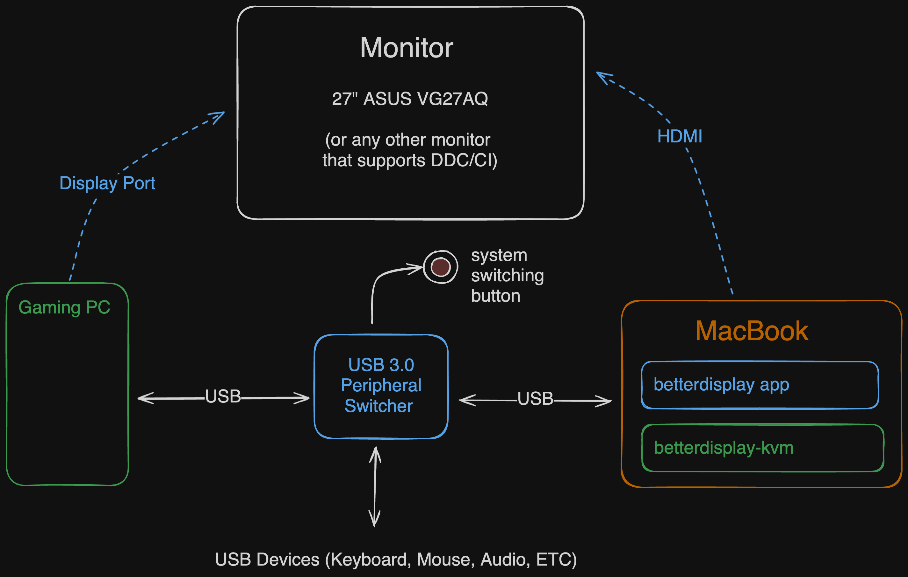

# BetterDisplay KVM

A Rust-based KVM switch utility for BetterDisplay that utilizes the [`betterdisplaycli`](https://github.com/waydabber/betterdisplaycli).

## How it works

This works by using the BetterDisplay app and CLI to issues commands to your monitor when a configured USB devices is connected/disconnected via the `betterdisplay-kvm` rust program. This uses the [DDC/CI](https://en.wikipedia.org/wiki/Display_Data_Channel) protocols to send commands directly to your monitor.

With the single press of a button you can switch over to you gaming PC or macBook seamlessly.

Diagram



## Why not use a KVM?

Because they don’t support high refresh rates without spending an ungodly amount of money.

## Config

```toml
# the USB device you'd like watch for
usb_device_id = "046d:c547"
# id that betterdisplaycli uses to configure input
system_one_input = 15
# id that betterdisplaycli uses to configure input
system_two_input = 18
# log level
log_level = "debug"
# if you use an lg monitor that doesnt follow the spec this might work if you enable it
ddc_alt = false

```

## Development

```
RUST_LOG=debug cargo watch -x run
```

## Install

Run the `./install.sh` and it will install a LaunchAgent and start the program.

## Uninstall

Run the `./uninstall.sh` and it remove the program and clean everything up.

### Roadmap
- [x] add a config system so others can use it
- [x] add some setup guide for adding a launch agent
- [ ] fix the hardcoded bin to betterdisplaycli from homebrew
- [ ] publish it to crates.io so you can just install from there
- [ ] codesign the bin for people wanting to use outside of homebrew
